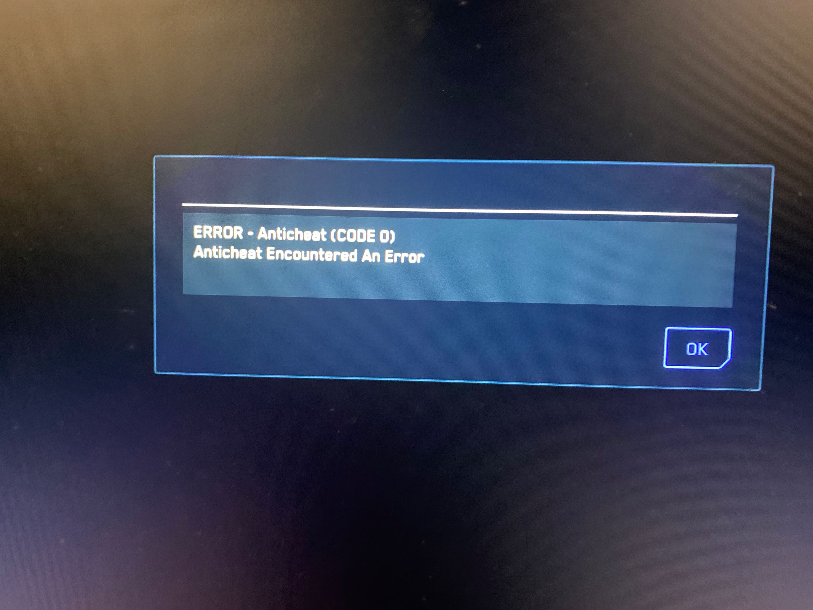
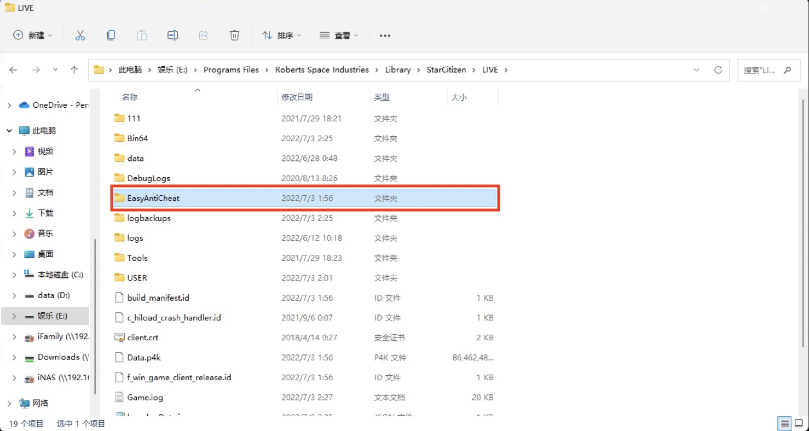
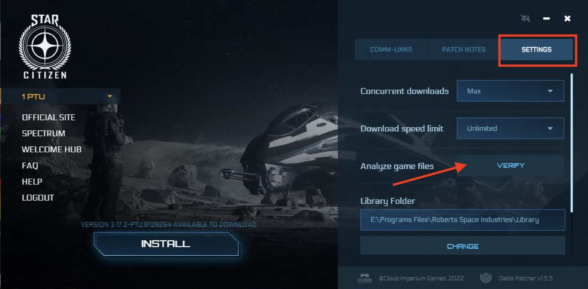

# CODE 0错误

一个典型的EAC CODE 0错误

初步推断为使用老汉化造成的EAC损坏，如果曾使用过老汉化请在**卸载**其后尝试进入游戏，如果依然存在此错误请依次尝试以下解决方案

1. 尝试重新点击完整安装覆盖汉化。

2. 卸载游戏目录`LIVE`文件夹中的`EasyAntiCheat`文件夹。

3. 使用启动器校验文件(依次点击`SETTINGS -> VERIFY`)

如果上述方案依然解决不了问题，欢迎加群**696608010**讨论。
