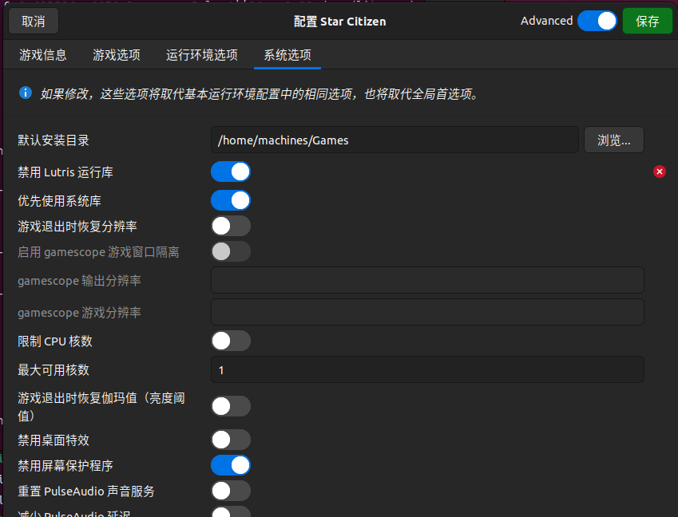
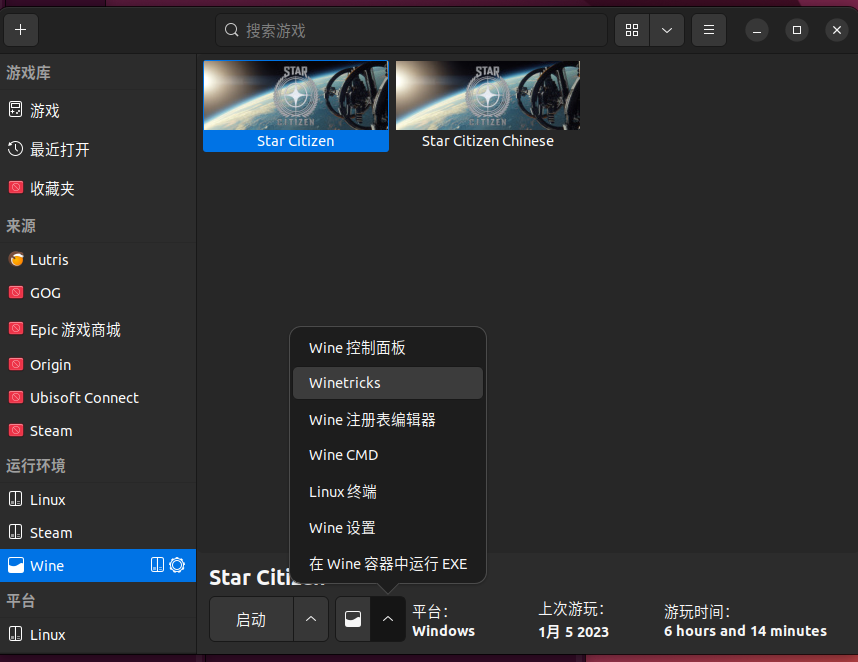
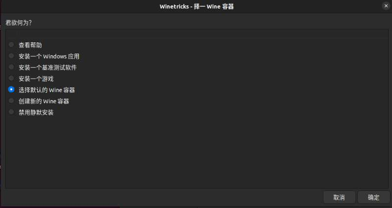
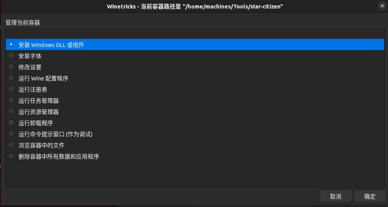
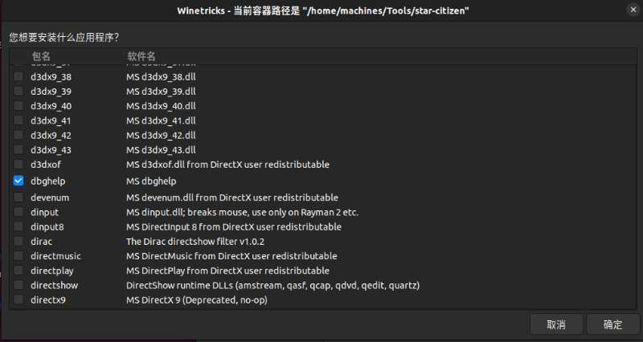
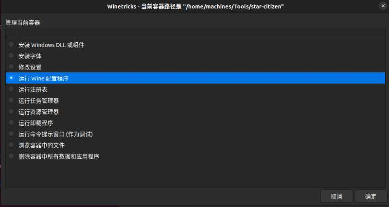
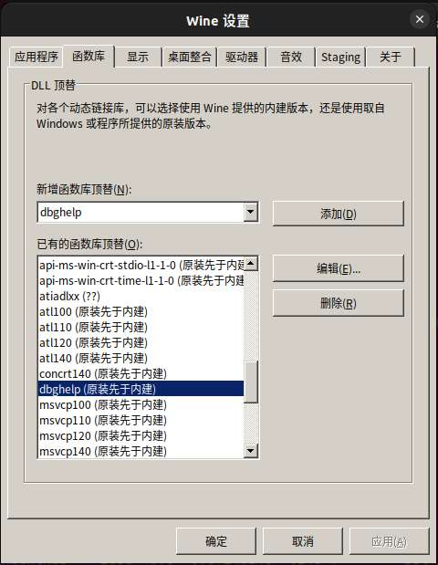

# 星际公民 Linux 汉化教程

# 1.前期准备

确保已经能够通过 Lutris 正常运行 StarCitizen

# 2.开始汉化

## 2.1.覆盖法汉化

具体参考：[星际公民汉化](https://w055zygb2d.feishu.cn/docx/TE0MdoEJ5oOUB8x6NuZc3fDinAf)

## 2.2.Lutris 配置

打开“禁用 Lutris 运行库”选项，Lutris 存在某些 Bug 需要禁用后才能进行后续操作

## 2.3.安装 dbghelp

点击箭头选择 Winetricks

选择默认的 Wine 容器，这里值得就是你游戏的 Wine

安卓 dbghelp 的 dll

## 2.4.配置运行顺序

由于默认情况下 wine 会先采用内建的而不是 windows 原装的所以需要配置，另外这个 dbghelp 是无法选择的需要手动添加。

选择函数库 Tab-> 在添加按钮旁边输入 dbghelp-> 点击添加-> 在下面找到 dbghelp 确定选的是原装先于内建

## 2.5.完成汉化

到此位置汉化已经完成了，在 Lutris 中点击启动正常登录就能进行汉化版的游戏了。

作者：SpenserCai
