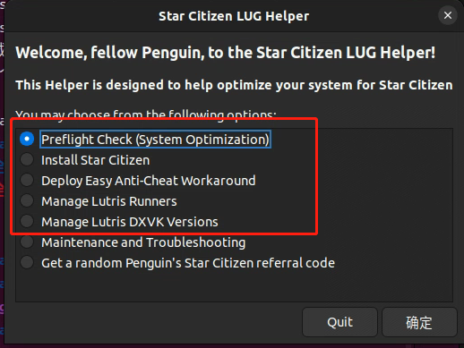
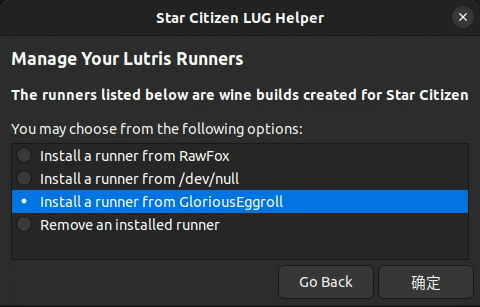
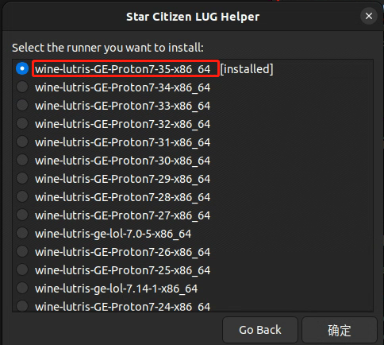
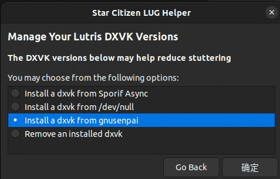
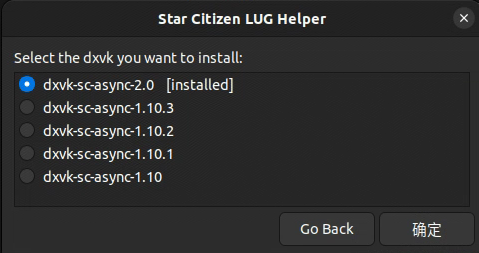
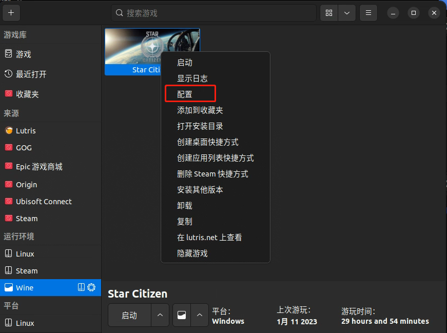
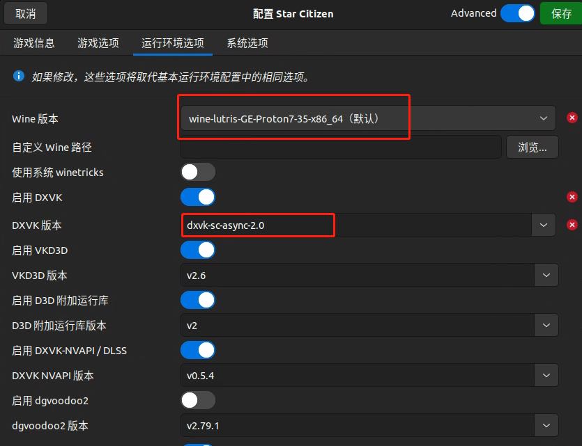

# Linux 畅玩星际公民

作者：SpenserCai
# 前言

众所周知，星际公民介绍的是 Windows 和 Linux 上的游戏，所以我在此总结了一种可以在 Linux 畅玩星际公民的方法。

# 原理介绍

星际公民的主程序是 windows 应用程序，如果要在 linux 运行那必然少不了 wine（一个在 linux 上运行 windows 程序的容器，而国外大佬开发了游戏版的分支 wine-ge（在后面的教程中会用到），这也就让 linux 上玩 windows 变成可能。当然如果你想在 linux 上玩 steam 游戏这边推荐 proton（wine 的分支，v 社开发并开源）。

# 准备工作

## 安装 Lutris

从官网下载 Lutris，这是一个开源的 linux 游戏平台，对于各种主流游戏都有安装脚本，由于我是 Ubuntu 系统所以下载的是 deb 包

下载地址：[https://github.com/lutris/lutris/releases](https://github.com/lutris/lutris/releases)

```
# 安装Lutris的依赖库
sudo apt install python3-lxml python3-setproctitle
# 安装主程序，如果安装过程中提示缺少依赖，根据需求接着安装
sudo dpkg -i lutris_0.5.12_all.deb
```

## 安装最新版 Wine

```
sudo dpkg --add-architecture i386
wget -nc https://dl.winehq.org/wine-builds/winehq.key
sudo apt-key add winehq.key
sudo apt-add-repository 'https://dl.winehq.org/wine-builds/ubuntu/'
sudo apt update
sudo apt install --install-recommends winehq-staging
```

## Winetricks 安装

winetricks 简单来说是一个可以快捷配置 wine 的工具，可以参考 [Github](https://github.com/Winetricks/winetricks) 上官方的的方法，也可以用我的方法：

从官网下载最新 release 版本：[https://github.com/Winetricks/winetricks/releases](https://github.com/Winetricks/winetricks/releases)

解压后进入目录中：

```
cd src
sudo mv winetricks /usr/bin
sudo mv winetricks.bash-completion /usr/share/bash-completion/completions/winetrick
sudo mv winetricks.1 /usr/share/man/man1/winetricks.1
```

# 开始安装

## 下载安装脚本

同样我们从万能的 Github 下载安装脚本

```
git clone https://github.com/starcitizen-lug/lug-helper.git
cd lug-helper/
chmod +x lug-helper.sh
bash lug-helper.sh
```

## 使用脚步配置游戏

此时我们会看到如下界面



先选择第一个检查全部通过后，点击第二个安装，安装完成后点击第三个干掉小蓝熊。



接下来选择 Manaage Lutris Runners->Install a runner from GloriousEggroll



找到最新版本进行安装



最后安装 DXVK，简单来说这是一个将 windows 上的显卡调用转换从 linux 的工具



也是安装最新版本，到这里 lug-helper 上的操作就都完成了接下来我们需要进行一点点的配置。

## Lutris 配置游戏

这一步其实非常简单，打开 Lutris 找到星际公民，右键，配置确保和下面第二张图一样即可，之后保存退出





# 安装完成

此时星际公民的安装就已经完成，如需汉化可以参考：[在Linux上安装汉化](/docs/linux-install-localization)
