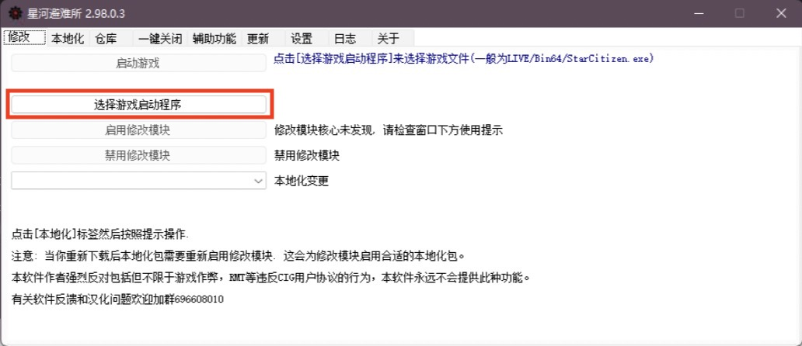
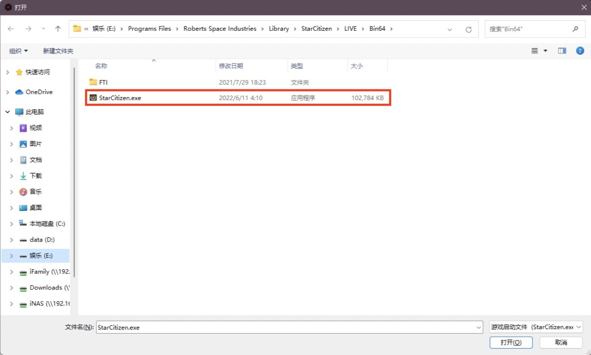
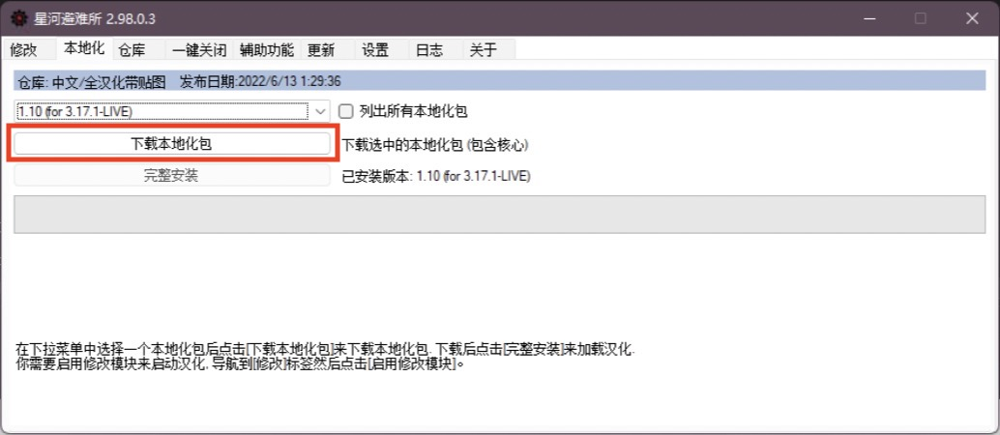
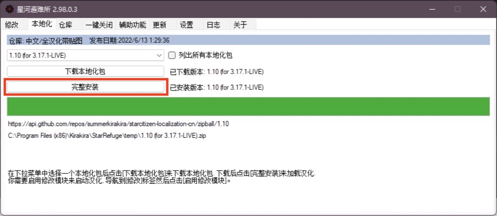
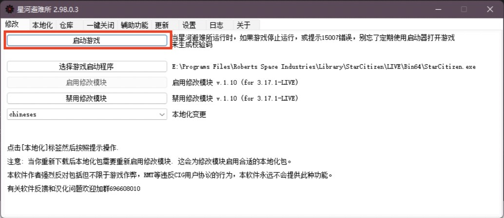
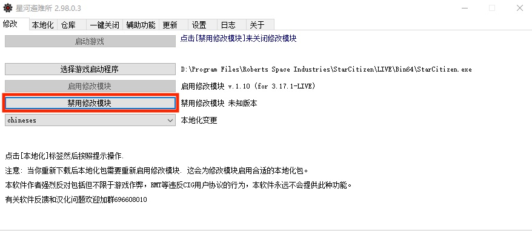
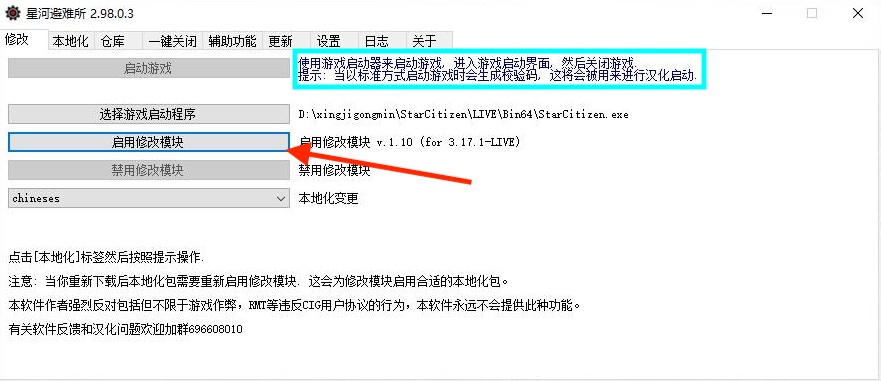
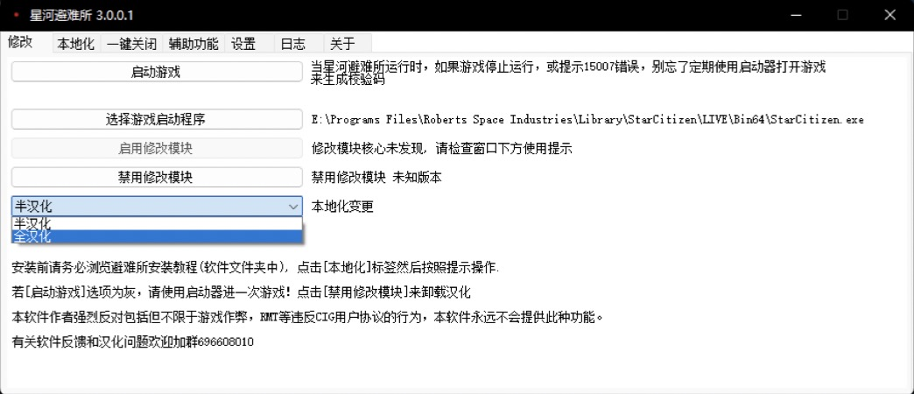

# 安装汉化

## 1.下载汉化工具

:::tip 提示
如果你已下载离线汉化版本(体积在500M左右)，解压压缩包后点击exe后缀的可执行文件即可。
:::

[点击此处下载](https://pan.baidu.com/s/1oqFhJINU_tkgLb__XJSgLg?pwd=kira)避难所离线包

<!--[点击此处下载](https://pan.baidu.com/s/11-VofW__GiJbtrGxcmUVDQ?pwd=kira)避难所离线包镖局版 -->

[点击此处下载](https://image.biaoju.site/starcitizen/app/StarRefuge.0.1.msi)汉化启动器(星河避难所)在线安装器并双击安装

汉化工具启动界面

## 2.选择游戏路径
:::caution 警告
请选择游戏文件位置而不是启动器位置！
:::

点击前图红框所示位置选择游戏文件位置

星际公民启动文件一般在LIVE/Bin64/StarCitizen.exe中，也可在官方启动器设置中获得。

## 3.安装汉化文件

:::warning 警告
如果你下载的是离线版本(体积在500M左右)，设置完成游戏路径以后直接点击完整安装即可！
:::

:::tip 提示
由于汉化包体积巨大，下载时间视网络条件而定（可能非常长！）长时间卡死或出错可以依次尝试关闭重新下载/开启加速器/开代理/加群下载离线版汉化包。
:::

点击本地化标签后点击下载汉化包按钮来下载汉化文件

下载完成后点击完整安装将汉化文件安装至游戏路径

:::tip 提示
如果安装时报错，说明文件校验失败，请重复步骤三：安装汉化文件
:::

## 4.启动游戏

依次完成以上步骤后，切换到修改标签页

点击启动游戏即可进入游戏。

如果启动选项如上图所示为灰，点击**禁用修改模块**后**使用官方启动器**进一次游戏登录界面生成校验码。

之后点击启用修改模块后即可启动游戏

如果游戏内提示15007错误说明校验码已过期，**禁用修改模块**后使用官方启动器重新进一次游戏即可刷新登录状态。

:::warning 版本3.0.0.0及以下的星河避难所
修改模块启用时无法通过官方启动器进入游戏（仅可通过星河避难所进入游戏）！如要使用官方启动器请先禁用修改模块！
:::
---
:::tip 以下教程仅适用于版本3.0.0.0及以上的星河避难所
安装汉化后可通过官方启动器直接进入游戏
:::

## 5.切换全汉化/半汉化

可以通过下拉框快速切换全/半汉化

## 6.卸载/禁用汉化

点击禁用修改模块即可