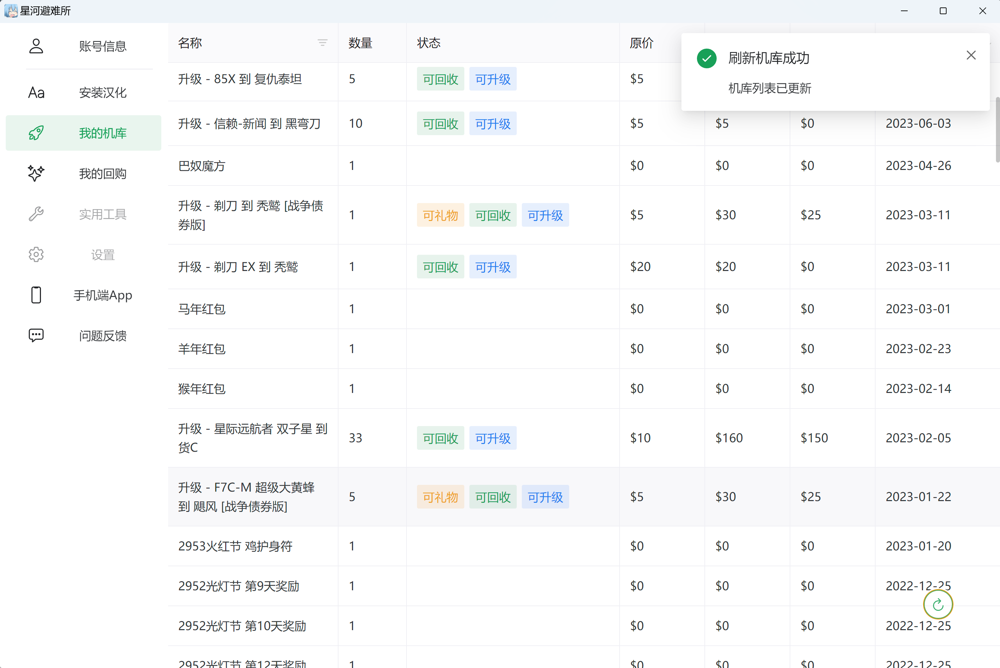
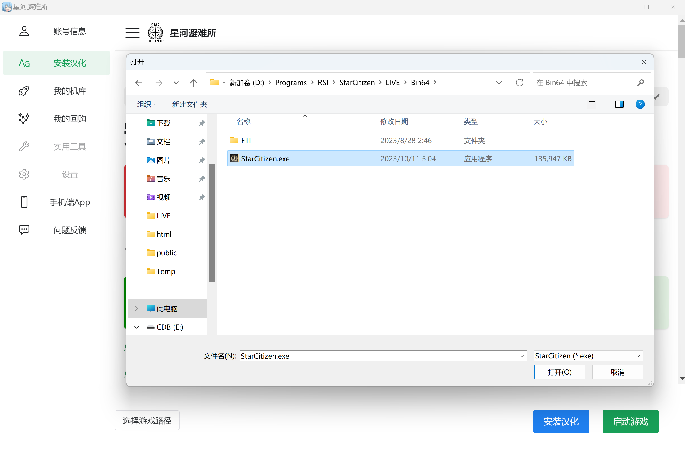
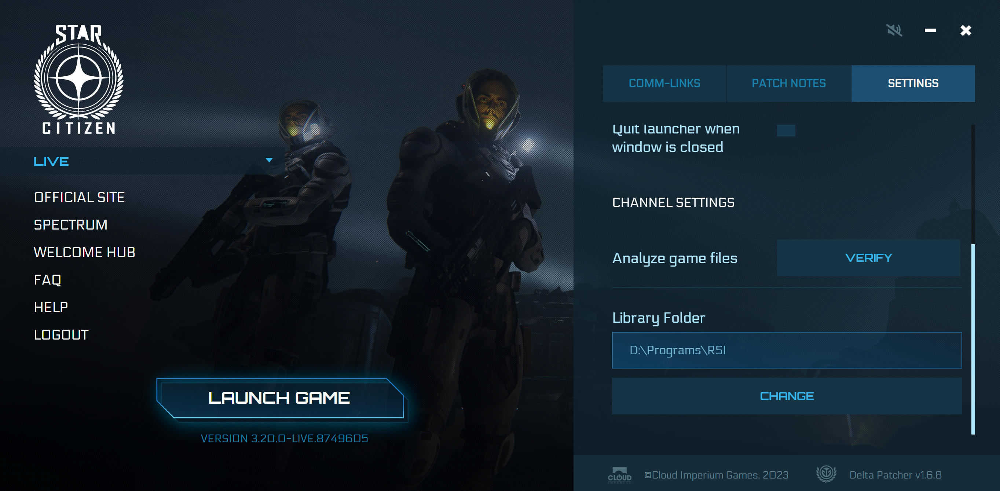
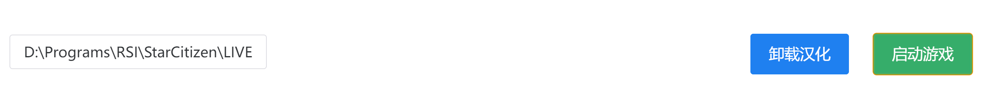

# 安装汉化

## 1.下载汉化工具

:::tip 提示
星河避难所无需且**不推荐**安装在游戏目录中
:::

[点击此处下载](https://pan.baidu.com/s/1zZaNs3n4qDvPGwG9C7WdtQ?pwd=kira) 星河避难所PC端安装包

避难所启动界面

## 2.选择游戏路径
:::caution 警告
请选择游戏位置而不是启动器位置！
:::

点击侧边栏上的安装汉化按钮，点击界面左下角的下拉菜单来选择游戏路径

星际公民启动文件一般在`LIVE\Bin64\StarCitizen.exe`中，也可在官方启动器设置中获得。

点击星际公民启动器右侧的Settings按钮，滚动到页面最底下的library folder就是你的游戏目录，以LIVE为例，需要定位的文件就是该目录下的`StarCitizen\LIVE\Bin64\StarCitizen.exe`
## 3.安装汉化

点击安装汉化界面右下角的安装汉化按钮，避难所将会自动下载并安装最新版的汉化文件。

## 4.启动游戏

:::tip 
在当前版本(3.20)安装汉化后也可通过官方启动器直接进入游戏
:::

在登录账号后，避难所可以帮助你直接登录游戏，从而摆脱官方启动繁琐的启动流程以及频繁的登录失效。直接点击右下角启动游戏即可。

## 5.卸载/禁用汉化

点击卸载汉化即可