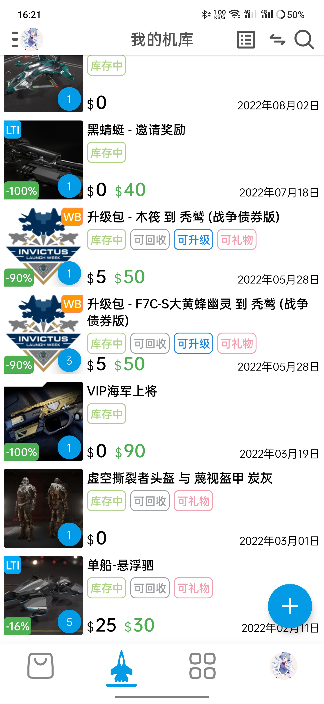

正确登录后，导航条左数第二页的个人机库界面如下图。

点击「可回收」图标可以进行机库物品回收操作。

点击「可升级」图标可以进行舰船升级操作。

点击「可礼物」图标可以打开飞船礼物界面。

黑色字体代表机库物品的实际价值（即购买时花费的钱）

绿色字体代表机库物品的现价（即无折扣的价格）

点击右下角的+号可以筛选机库物品。

点击右上角的切换图标可以在回购和机库之间切换。

切换图标的左边可以打开机库日志（hangar log）界面。

