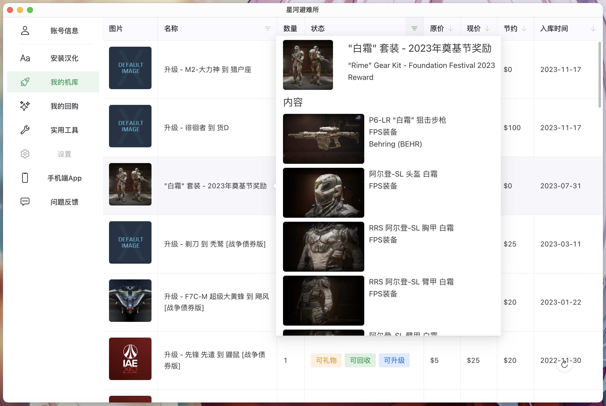
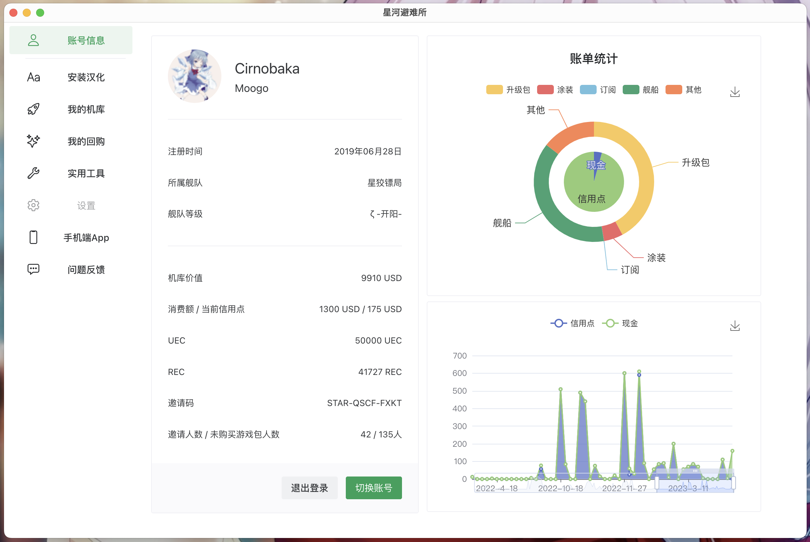
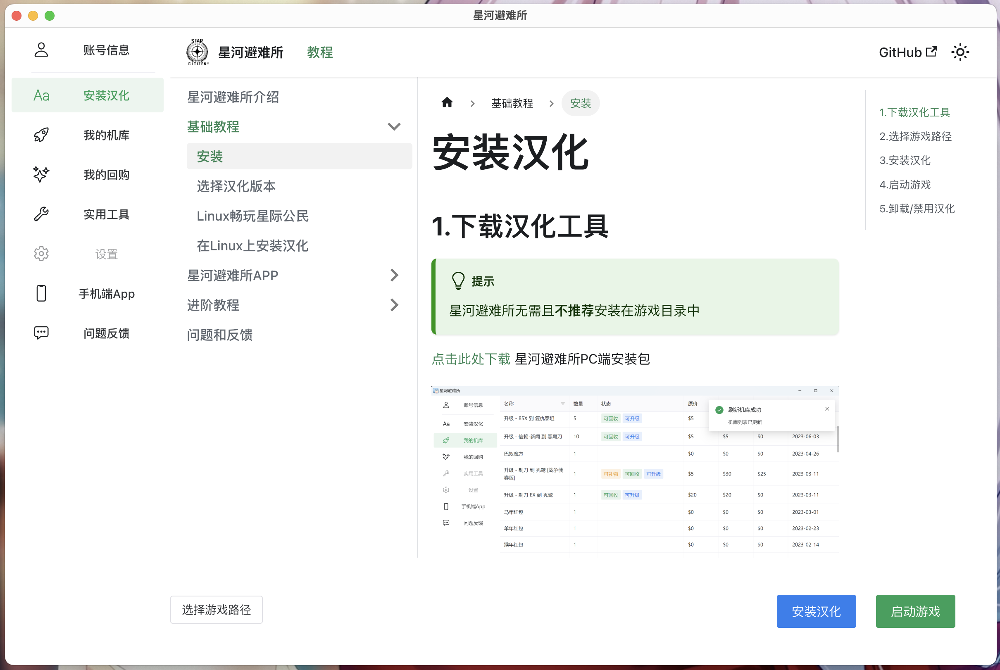
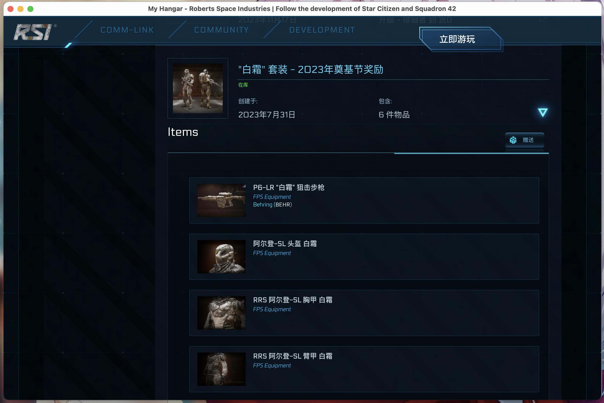

# 功能介绍

关于避难所PC的**下载和安装介绍**，请前往[下载安装页面](./star-refuge-pc-install)

### 1. 机库管理

截至版本`v1.1.0`，星河避难所PC端已实现大多数避难所安卓端功能，支持但不限于融船、礼物、机库物品原价与现价计算、按特征排序筛选等功能。

### 2. 个人信息显示

像安卓端一样，星河避难所PC端能自动获取消费额，当前信用点，消费额等信息。另外，PC端还添加了历史账单分析功能，如上图所示，避难所能将历史消费情况以饼图和折线图的方式直观的显示出来。

### 3. 汉化相关

避难所依然支持星际公民的游戏汉化，只需一步即可完成汉化的安装、更新与卸载。

在将库存整理为更直观的机库界面的同时，避难所PC也为官网提供了汉化支持，截至`v1.1.0`避难所提供的汉化已经基本覆盖全部机库物品。此外，避难所也为光谱、商店等提供了快速入口，这些窗口都能与避难所的多账户系统融合，无需额外操作就能快速在多个不同的账号间切换。

### 4. 启动相关
星河避难所PC提供了快速启动游戏的功能，只需一键即可进入游戏，当检测到游戏版本过低时，避难所会智能引导前往官方启动器更新游戏。

### 5. 实用工具
避难所整合了部分SC比较实用的工具站点，也为官网部分常用页面提供了快速入口。避难所还提供了例如游戏下载直链提取等实用小功能，在未来的更新中，避难所也计划提供在外部更改游戏设置（如FOV、画质）自动备份键位绑定等功能。

### 6. 多端支持
避难所PC同时支持Windows、Mac、Linux（加上安卓的移动端除iOS外，已覆盖主流设备（

### 7. 完全开源
出于账户安全考量，星河避难所PC以MIT协议（仅保留署名权）开源。代码托管在[starcitizen-lite-pc](https://github.com/summerkirakira/starcitizen-lite-pc)。