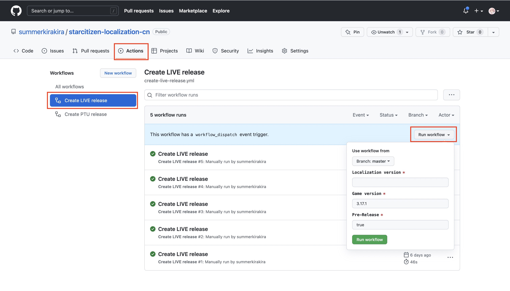
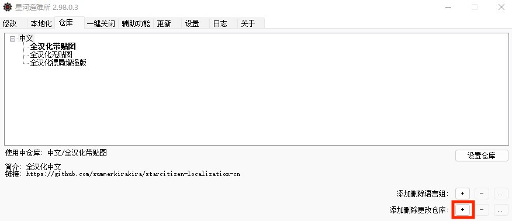
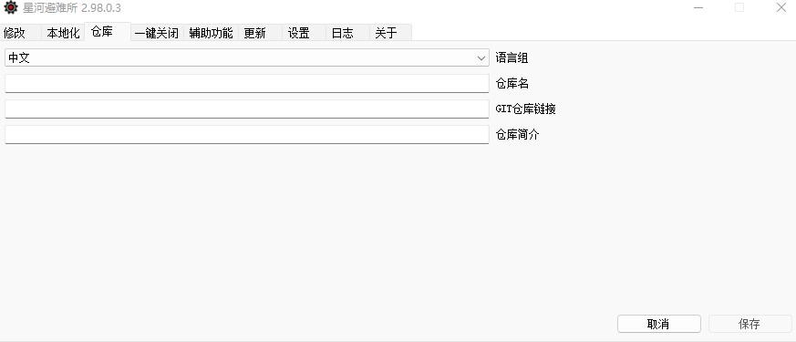

# 创建自己的汉化

:::tip 提示
阅读此部分默认你已拥有Git基础，如果你不了解Git，请先简单学习Git知识。
:::

## 1.Fork现有本地化仓库

推荐使用我已创建的全汉化+贴图仓库 https://github.com/summerkirakira/starcitizen-localization-cn (此处以该仓库为例)

## 2.下载克隆后的仓库
```bash
git clone git@github.com:summerkirakira/starcitizen-localization-cn.git // 此处替换为你fork的仓库
git checkout 3_17_2 // 切换到当前最新分支
```

## 3.仓库目录结构说明
```bash
|-- Localization
    |-- README.md
    |-- gen_files_index.py
    |-- modding-begin.py
    |-- modding-end.py
    |-- package-lock.json
    |-- package.json
    |-- patcher.bin                       //汉化修改核心文件
    |-- patcher.py
    |-- .github                           //GitHub Action
    |   |-- workflows
    |       |-- create-live-release.yml
    |       |-- create-ptu-release.yml
    |-- data
        |-- config.xml
        |-- global.ini                    // 游戏文本汉化对应表
        |-- system.cfg                    // 游戏画质配置文件
        |-- Localization
        |   |-- chineses
        |       |-- HUD_Font_LocFont.gfx
        |       |-- HUD_Font_LocFont.swf
        |       |-- HUD_Font_LocFont_glyphs.gfx
        |       |-- HUD_Font_LocFont_glyphs.swf
        |       |-- global.ini
        |-- Objects/
        |-- UI/
```

## 4.汉化发行

修改汉化并上传GitHub后可以使用GitHub Action快速制作发行版(当然你也可以自己发版)此处以GitHub Action为例。



稍等片刻，Action即可完成发行的全部步骤。

## 5.添加汉化版本



点击+号添加仓库



填入fork仓库的GitHub链接，之后按照汉化教程安装就可使用个性化汉化啦！
