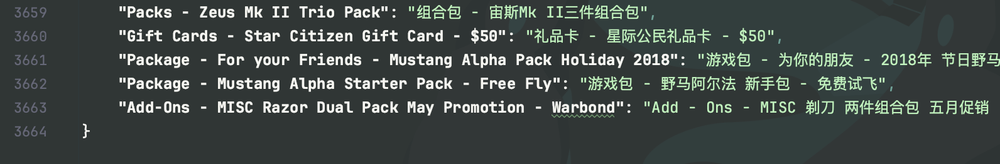
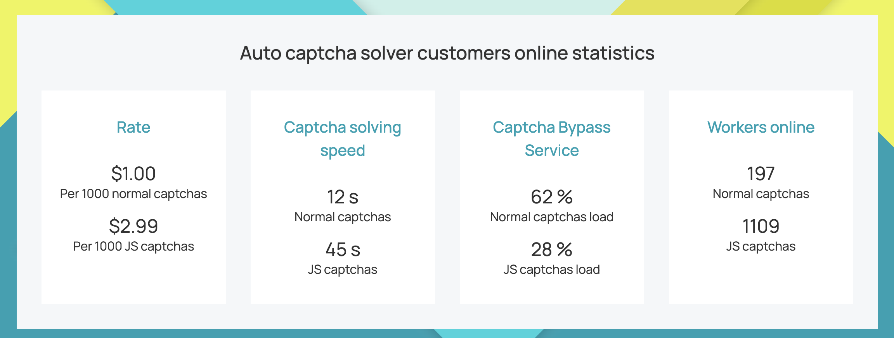
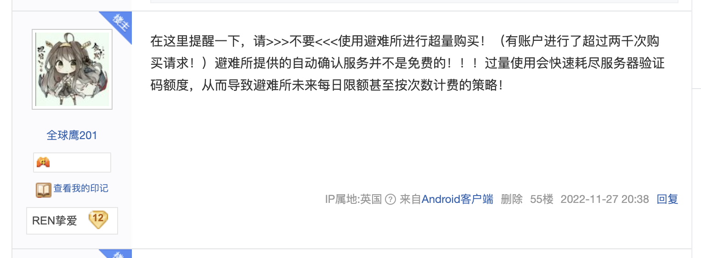
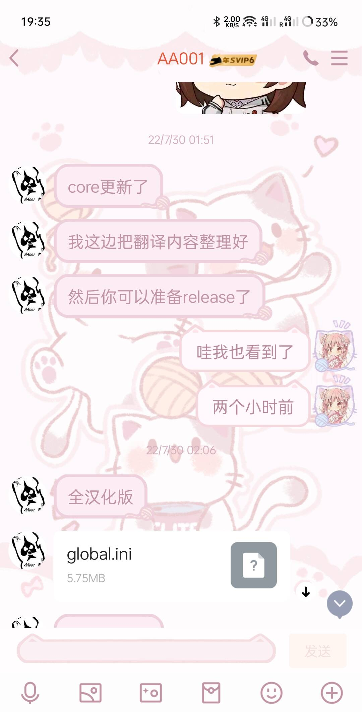

### 此处专用于解决关于避难所App和PC的疑惑

Q1.避难所App的相关功能会把账号数据发送到服务器

A1.大错特错！避难所仅在必要时与服务器进行通信，从而下载舰船名称汉化，现价等信息，且所有操作通过一个本地随机生成的uuid来鉴权。（这就是为什么卸载或清空数据后避难所订阅会消失）至于为什么舰船路径规划需要服务器生成，因为咱毕竟是个python程序员，CCU规划时使用的networkx库（一个用来计算网络最小路径的库）是真不知道怎么在本地实现呀！除此之外，一切操作都在本地进行。某人所说的所有操作都在服务器进行真不知道是哪传的谣言，作为一个开源软件，只要看看源码就能解决的疑惑竟然传播这么广。很难不怀疑是有些人揣着明白装糊涂。

PS. 附上我个人汉化的机库内容截图，汉化的机库内容截至目前已经超过3600条。

感谢卡布、小明、238等群友提供的汉化帮助，其中绝大部分都是我个人完成的。在这里感谢汉化组提供的名词对照表帮了很大的忙，但也要认识到我这边的汉化压力并不比汉化组任何一个成员低。

Q2.为什么会有Tokn这个东西

A2.玩SC久的人都知道，RSI官网在进行登录和购买操作的时候都会需要一个肉眼看不见的验证码(它被称为Invisible reCAPTCHA)，之前国内无法登录官网就是这东西的锅。顺带一提，B站免代理登录官网的教程就是我之前做的。

在避难所开发的年代（大概两年前），这个验证码是没办法在本地生成的，所以我想到了一个方法，使用专业的提供绕过验证码服务网站2Captcha来获取这个Token，具体实现流程是避难所后端拥有一个秘钥，从2Captcha获取一些验证码，放在一个五分钟过期的池子里，当客户端需要时发给客户端。

但是！2Captcha提供的这个服务并不是免费的！具体看下图

1000次服务大概需要3美元。这意味着避难所App每进行1000次登录或购买操作，我就要向2Captcha支付20元。

在避难所开发初期，是按照大家都正常使用来构思的，这样我每月花几百元也问题不大，所有是没有任何限制Token点数的措施的。这导致有些商人使用避难所进行了远超正常使用的Token调用，最夸张的情况下服务器单次就会收到超过500个验证码请求。

这样不仅会给服务器造成压力，同时付给2Captcha的费用也是个不小的数额。

这是22年11月的消息，之后避难所就上线了Token限制措施。某些人但凡用过就会知道，Token的数量是每月刷新的，正常使用是绝对不会用光的。

<!-- Q3. 避难所蹭汉化软件“避难所”的名字
Q3. 这更是可笑至极。这两个软件 全 是 本人开发的开源软件，只要看提交日志就能发现手机端避难所远早于电脑端。至于为什么这两个同名，原因非常简单，所谓汉化软件一开始便是作为避难所的桌面端来开发的，汉化组觉得好就拿过去用了。

之前的避难所桌面端是在另一款开源的汉化软件Starcitizen-Helper的基础上开发，原软件是在VB上开发的，写起来相当痛苦。当然现在的避难所PC完全重构了之前的屎山，和Starcitizen-Helper的代码无任何关系。 -->

